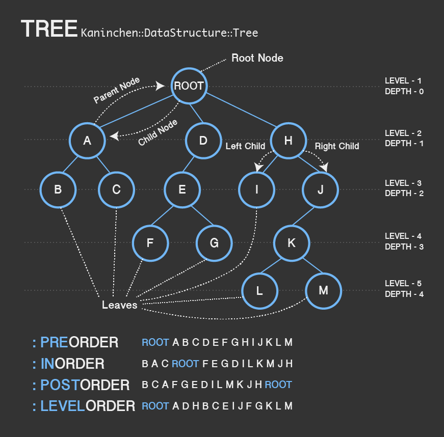

# Kaninchen

Simple implementation of data structures (and algorithms in future) in Ruby programming language.

Currently support data structures:

- Stacks
- Tree

## Installation

Add this line to your application's Gemfile:

```ruby
gem 'kaninchen'
```

And then execute:

    $ bundle

Or install it yourself as:

    $ gem install kaninchen

## Stack

### Basic Usage

```ruby
# Creata a new stack data structure
stack = Kaninchen::DataStructure::Stack.new

# Use the push method to push in data
stack.push(1)

# Chained method is also allowed
stack.push(2).push(3).push(4)

# Or you can use the #<< method which is alias to push
stack << 5 << 6 << 7

# Check the size of the stack
stack.size # -> 7

# Pop out stack
stack.pop # -> 7
stack.pop # -> 6
stack.pop # -> 5

# Empty stack will pop out nil value
empty_stack = Kaninchen::DataStructure::Stack.new
empty_stack.pop # -> nil

# Using bang method pop! in empty stack will raise error
empty_stack.pop!
# -> Kaninchen::PopEmptyStackError: Popping out empty stack
```

## Tree



### Basic Usage

```ruby
# Create a new tree data structure and initialize the root node value
tree = Kaninchen::DataStructure::Tree.new 'ROOT'
tree.class # -> Kaninchen::DataStructure::Tree

# Tree has a root node which holds the string value 'ROOT'
tree.root.class # -> Kaninchen::DataStructure::Node
tree.root.value # -> 'ROOT'

# Root node is the root of the tree and is also a kind of tree node
tree.root.root?      # -> true
tree.root.tree_node? # -> true

# Root node is not a nil node
tree.root.nil? # -> false

# Create a node which holds the value 'CHILD'
node = Kaninchen::DataStructure::Node.new 'CHILD'

# Node currently is not a tree node, which is also a kind of "nil node"
node.tree_node? # -> false
node.nil?       # -> true

# Attach the node to the tree root node using the #<< method
tree.root << node

# Now the tree has a child node and the node's parent is the root node
tree.root.children.size        # -> 1
tree.root.children[0] === node # -> true
node.parent === tree.root      # -> true

# Now node is not nil node anymore, it belongs to the tree node
node.nil?          # -> false
node.tree_node?    # -> true
node.tree === tree # -> true
node.root?         # -> false
```

### Attaching Nodes

Chained `#<<` method:

```ruby
# Assume tree is the Kaninchen::DataStructure::Tree type and n1, n2, n3
# are Kaninchen::DataStructure::Node type

tree.root << n1 << n2 << n3
tree.root.children.size      # -> 3
tree.root.children[0] === n1 # -> true
tree.root.children[1] === n2 # -> true
tree.root.children[2] === n3 # -> true
n1.parent === tree.root      # -> true
n2.parent === tree.root      # -> true
n3.parent === tree.root      # -> true
```

Array of nodes case:

```ruby
# Assume tree is the Kaninchen::DataStructure::Tree type and n1, n2, n3
# are Kaninchen::DataStructure::Node type
tree.root << [n1, n2, n3]
tree.root.children.size      # -> 3
tree.root.children[0] === n1 # -> true
tree.root.children[1] === n2 # -> true
tree.root.children[2] === n3 # -> true
n1.parent === tree.root      # -> true
n2.parent === tree.root      # -> true
n3.parent === tree.root      # -> true
```

Hash of nodes case:
```ruby
# Assume tree is the Kaninchen::DataStructure::Tree type and n1, n2, n3
# are Kaninchen::DataStructure::Node type
tree.node << { n1 => n2, n3 => nil }
tree.root.children.size                  # -> 2
tree.root.children[0] === n1             # -> true
tree.root.children[1] === n3             # -> true
tree.root.children[0].size               # -> 1
tree.root.children[1].size               # -> 0
tree.root.children[0].children.size      # -> 1
tree.root.children[0].children[0] === n2 # -> true
n1.parent === tree.root                  # -> true 
n2.parent === n1                         # -> true
n3.parent === tree.root                  # -> true
```

Mixed structure case (array and hash composition):
```ruby
# Assume tree is the Kaninchen::DataStructure::Tree type and n1, n2, n3
# n4, n5 are Kaninchen::DataStructure::Node type
tree.node << [n1, { n2 => [n3, n4], { n5 => nil } }]

# Tree Structure:
# ROOT ---> n1
#       |-> n2 ---> n3
#       |       |-> n4
#       |-> n5
#
```

### Tree Node Order & Traversal

Available methods associated with tree node order and traversal is listed below:

- `Tree#nodes`: Default returns an array of `Node` type objects which represents the preorder of the tree nodes
- `Tree#node_values`: Default returns an array of `Node` type objects' values which represents the preorder of the tree nodes
- `Tree#each_node`: Default iterates the tree nodes in preorder format which requires a given block
- `Tree#each_node_with_index`: Default iterates the tree nodes with index specified in preorder format which requires a given block

These methods can pass in optional parameter, when pass in:

- `:preorder` or `:depth_first`: Preorder mode
- `:inorder`: Inorder mode
- `:postorder`: Postorder mode
- `:levelorder` or `:breadth_first`: Level order mode

### Properties of Tree

- `Tree#height`: The height of the tree
- `Tree#leaves`: The leaves of the tree

### Properties of Tree Nodes

- `Node#type`: Returns the symbol object `:tree`
- `Node#degree`: The degree of the tree node (which is the count of the subtrees of the node)
- `Node#depth`: The depth of the tree node (which is the distance between the node and the tree root of the node)
- `Node#height`: The height of the tree node (which is the longest path to the leaves of the subtree of the node)
- `Node#subtree`: Returns the new tree type object which is the subtree of the node
- `Node#path`: Returns the path from the node to the root node as an array
- `Node#parent`: Returns the parent node of the node
- `Node#children`: Returns the child nodes of the node
- `Node#left_child`: Returns the left child node of the node
- `Node#right_child`: Returns the right child node of the node. (If there are over two children, it will return the second child node in default)
- `Node#leaf?`: Returns `true` if the node is the leaf of the tree

## Development

After checking out the repo, run `bin/setup` to install dependencies. Then, run `rake spec` to run the tests. You can also run `bin/console` for an interactive prompt that will allow you to experiment.

To install this gem onto your local machine, run `bundle exec rake install`. To release a new version, update the version number in `version.rb`, and then run `bundle exec rake release`, which will create a git tag for the version, push git commits and tags, and push the `.gem` file to [rubygems.org](https://rubygems.org).

## Contributing

Bug reports and pull requests are welcome on GitHub at https://github.com/[USERNAME]/kaninchen.

## License

The gem is available as open source under the terms of the [MIT License](http://opensource.org/licenses/MIT).
